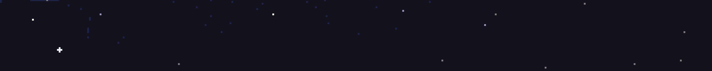

# Hello! I'm Dmitry 👋

#### About me:

<ul>
  <li>🌍 I know languages: UA(C2) RU(C2) EN(B1)</li>
  <li>🎓 Education: Software Engineer (121)</li>
  <li>⤴️ Alternative direction: Backend</li>
</ul>

<h2 id="skills">My skills</h2>

> Languages

<table width='100%'>
  <tr>
    <td align="center" width="100" height="100">
      
       JavaScript
    </td>
    <td align="center" width="100" height="100">
      
       TypeScript
    </td>
    <td align="center" width="100" height="100">
      
       Solidity
    </td>
    </tr>
</table>

> Basic

<table width='100%'>
  <tr>
    <td align="center" width="100" height="100">
      
       HTML5
    </td>
    <td align="center" width="100" height="100">
      
       CSS
    </td>
    <td align="center" width="100" height="100">
      
       NPM
    </td>
    <td align="center" width="100" height="100">
      
       GitHub
    </td>
    <td align="center" width="100" height="100">
      
       Figma
    </td>
  </tr>
</table>

> Frontend

<table width='100%'>
  <tr>
    <td align="center" width="100" height="100">
      
       React
    </td>
    <td align="center" width="100" height="100">
      
       Next JS
    </td>
    <td align="center" width="100" height="100">
      
       Redux
    </td>
    <td align="center" width="100" height="100">
      
       Zustand
    </td>
    <td align="center" width="100" height="100">
      
       Recoil
    </td>
    <td align="center" width="100" height="100">
      
       Sass
    </td>
    <td align="center" width="100" height="100">
      
       Tailwind
    </td>
  </tr>

  <tr>
    <td align="center" width="100" height="100">
      
       Forms
    </td>
    <td align="center" width="100" height="100">
      
       Socket.io
    </td>
    <td align="center" width="100" height="100">
      
       SWR
    </td>
    <td align="center" width="100" height="100">
      
       Framer-M
    </td>
    <td align="center" width="100" height="100">
      
       Vite
    </td>
    <td align="center" width="100" height="100">
      
       Axios
    </td>
    <td align="center" width="100" height="100">
      
       Zod
    </td>
  </tr>

  <tr>
    <td align="center" width="100" height="100">
      
       TanStack Router
    </td>
    <td align="center" width="100" height="100">
      
       Apollo
    </td>
    <td align="center" width="100" height="100">
      
       Auth0
    </td>
  </tr>
</table>

> Backend

<table width='100%'>
  <tr>
    <td align="center" width="100" height="100">
      
       Nest JS
    </td>
    <td align="center" width="100" height="100">
      
       Node JS
    </td>
    <td align="center" width="100" height="100">
      
       Express
    </td>
    <td align="center" width="100" height="100">
      
       MongoDB
    </td>
      <td align="center" width="100" height="100">
      
       GraphQL
    </td>
    <td align="center" width="100" height="100">
      
       JWT
    </td>
    <td align="center" width="100" height="100">
      
       Socket.io
    </td>
  </tr>

  <tr>
    <td align="center" width="100" height="100">
      
       Apollo
    </td>
  </tr>
</table>

> Blockchain

<table width='100%'>
  <tr>
    <td align="center" width="100" height="100">
      
       Web3
    </td>
    <td align="center" width="100" height="100">
      
       Ethers
    </td>
    <td align="center" width="100" height="100">
      
       Hardhat
    </td>
    <td align="center" width="100" height="100">
      
       Ganache
    </td>
    <td align="center" width="100" height="100">
      
       MetaMask
    </td>
  </tr>
</table>

> Testing

<table width='100%'>
  <tr>
    <td align="center" width="100" height="100">
      
       Cypress
    </td>
  </tr>
</table>

> Code quality

<table width='100%'>

  <tr>
    <td align="center" width="100" height="100">
      
       Prettier
    </td>
    <td align="center" width="100" height="100">
      
       Eslint
    </td>
  </tr>
</table>
